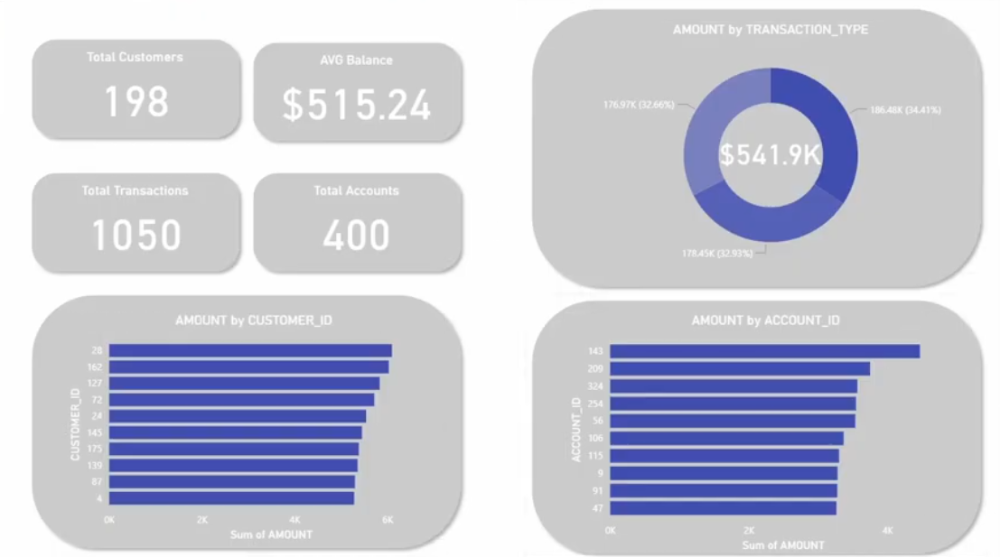

# Banking Real-time Analytics Pipeline

A production-ready, end-to-end real-time data pipeline that captures banking transactions as they happen and transforms them into actionable business insights. This project showcases modern data engineering architecture by streaming data from an operational PostgreSQL database through Kafka, storing it in a data lake, processing it in Snowflake data warehouse, and visualizing it in Power BI dashboards.

The pipeline demonstrates enterprise-grade patterns including Change Data Capture (CDC) for real-time data replication, event-driven architecture for scalability, slowly changing dimensions (SCD Type 2) for historical tracking, and automated data quality testing. Built with industry-standard tools like Debezium, Apache Kafka, Airflow, dbt, and Snowflake, this project serves as a comprehensive reference implementation for building resilient, scalable data platforms.

## 📋 Project Overview

This project implements a production-grade data pipeline that:

- **Captures real-time changes** from a PostgreSQL banking database using Debezium CDC (Change Data Capture)
- **Streams events** through Apache Kafka for reliable, distributed message delivery
- **Stores raw data** in MinIO (S3-compatible object storage) as Parquet files, partitioned by date
- **Orchestrates workflows** using Apache Airflow to move data from the lake to warehouse
- **Loads data** into Snowflake data warehouse with VARIANT schema for flexibility
- **Transforms data** using dbt (data build tool) with staging, snapshots (SCD Type 2), and marts layers
- **Visualizes insights** through Power BI dashboard connected to the analytics layer
- **Automates testing and deployment** with GitHub Actions CI/CD pipelines

### Technologies Used

| Layer | Technology |
|-------|------------|
| Source Database | PostgreSQL |
| Change Data Capture | Debezium |
| Event Streaming | Apache Kafka |
| Data Lake | MinIO (S3-compatible) |
| File Format | Apache Parquet |
| Orchestration | Apache Airflow |
| Data Warehouse | Snowflake |
| Transformation | dbt (data build tool) |
| Visualization | Power BI |
| CI/CD | GitHub Actions |
| Containerization | Docker & Docker Compose |

## 🏗️ Architecture


**Data Flow:**
1. Producer → PostgreSQL (customers, accounts, transactions)
2. Debezium → Kafka Topics (CDC events)
3. Consumer → MinIO (Parquet files, partitioned by date)
4. Airflow → Snowflake RAW (VARIANT columns)
5. dbt → Analytics Layer (staging → snapshots → marts)
6. Power BI → Dashboard

## 📊 Dashboard



The Power BI dashboard provides real-time insights into:
- Customer analytics and segmentation
- Account performance metrics
- Transaction patterns and trends
- Historical data tracking with SCD Type 2

## 🚀 Quick Start

### Prerequisites

- Docker & Docker Compose
- Python 3.9+
- Snowflake account
- Git

### Setup

1. **Clone and configure**
```bash
git clone https://github.com/yourusername/banking-realtime-analytics.git
cd banking-realtime-analytics
cp .env.example .env
cp docker/dags/.env.example docker/dags/.env
```

2. **Generate Airflow secrets**
```bash
python -c "from cryptography.fernet import Fernet; print(Fernet.generate_key().decode())"
python -c "import secrets; print(secrets.token_urlsafe(64))"
```
Add these to `.env` file.

3. **Update Snowflake credentials** in `.env`

4. **Initialize Snowflake**
```sql
CREATE WAREHOUSE IF NOT EXISTS BANKING_WH;
CREATE DATABASE IF NOT EXISTS BANKING;
CREATE SCHEMA IF NOT EXISTS BANKING.RAW;

CREATE TABLE RAW.CUSTOMERS (DATA VARIANT, INGESTED_AT TIMESTAMP_NTZ);
CREATE TABLE RAW.ACCOUNTS (DATA VARIANT, INGESTED_AT TIMESTAMP_NTZ);
CREATE TABLE RAW.TRANSACTIONS (DATA VARIANT, INGESTED_AT TIMESTAMP_NTZ);
```

5. **Start services**
```bash
docker compose up -d --build
```

### Run Pipeline

```bash
# 1. Generate data
cd producer && python producer.py

# 2. Create CDC connector
cd ../connector && python create_connector.py --recreate

# 3. Consume to MinIO
cd ../consumer && python consumer.py

# 4. Trigger Airflow DAG at http://localhost:8080

# 5. Run dbt transformations
cd ../banking_dbt
dbt deps
dbt snapshot
dbt run
dbt test
```

### Access Services

| Service | URL | Credentials |
|---------|-----|-------------|
| Airflow | http://localhost:8080 | admin/admin |
| MinIO | http://localhost:9001 | minioadmin/minioadmin |
| Debezium | http://localhost:8083 | - |

## 📁 Repository Structure

```
banking-realtime-analytics/
├── .github/workflows/       # CI/CD pipelines
├── banking_dbt/             # dbt project (staging, snapshots, marts)
├── connector/               # Debezium connector setup
├── consumer/                # Kafka → MinIO consumer
├── dags/                    # Airflow DAGs
├── docs/                    # Architecture & dashboard diagrams
├── producer/                # Data generator
├── docker-compose.yml       # Infrastructure services
└── README.md
```

## 🧪 CI/CD

### Continuous Integration
- Linting with ruff
- Unit tests with pytest
- dbt model validation

### Continuous Deployment
- Automated dbt runs on push to main
- Snowflake deployment

**Required GitHub Secrets:**
- `SNOWFLAKE_ACCOUNT`
- `SNOWFLAKE_USER`
- `SNOWFLAKE_PASSWORD`
- `SNOWFLAKE_WAREHOUSE`

## 📝 License

MIT License - see [LICENSE](LICENSE) file.

## 🙏 Acknowledgments

Built with Debezium, Kafka, MinIO, Airflow, Snowflake, dbt, and Power BI.

---
